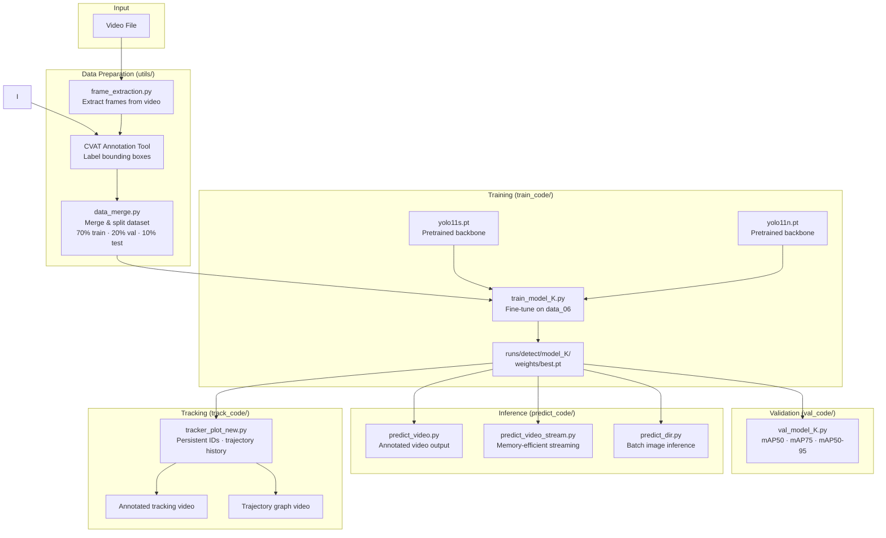
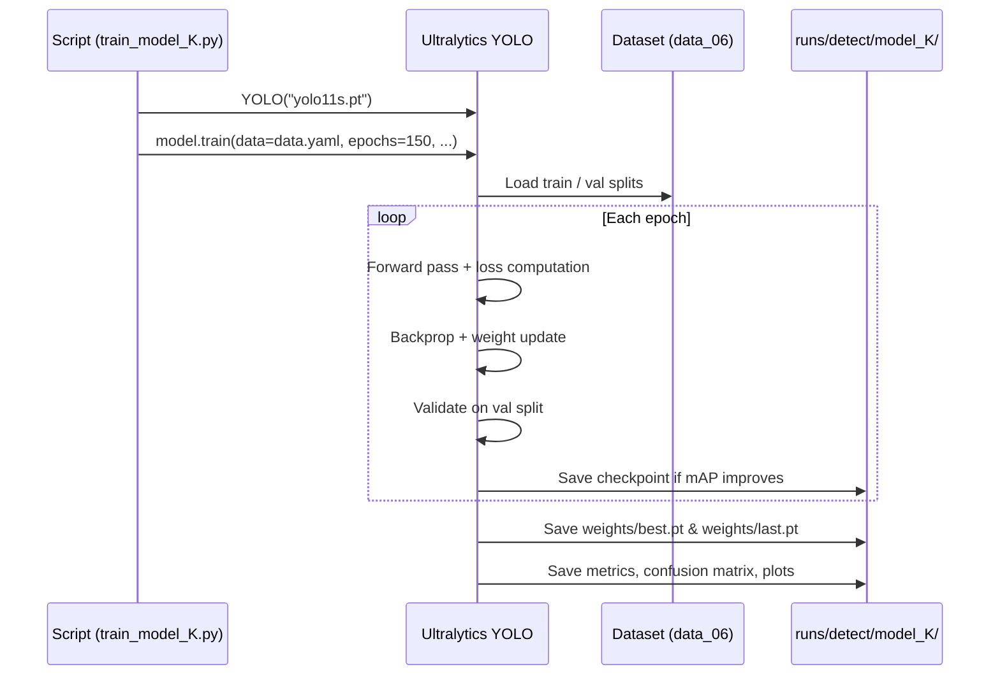
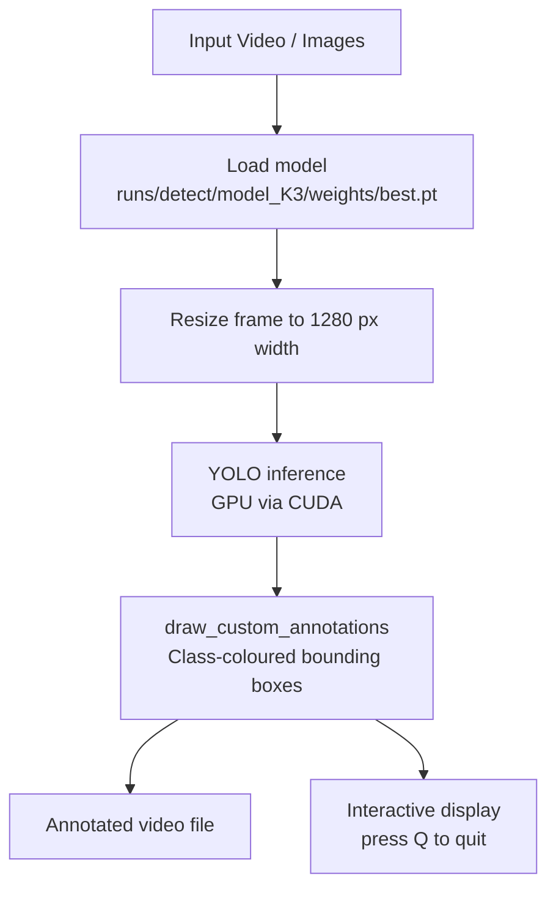
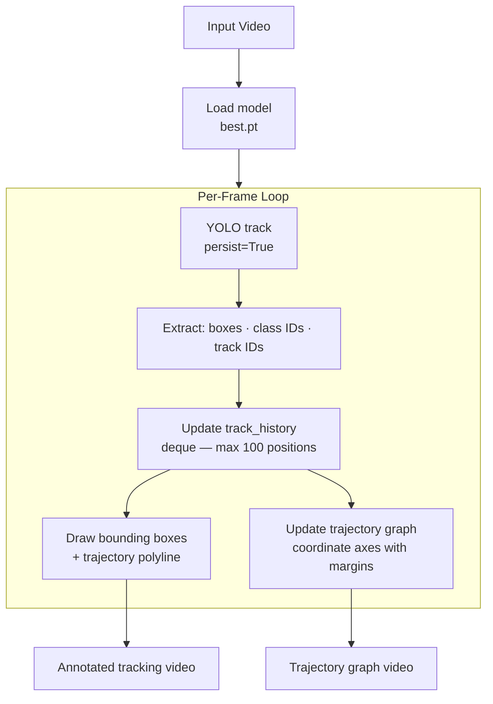
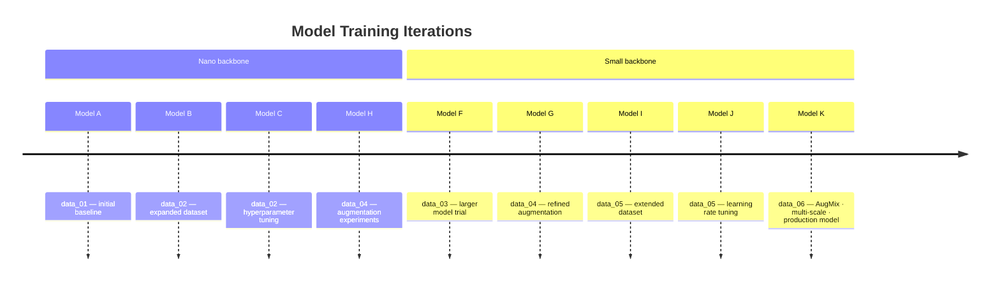
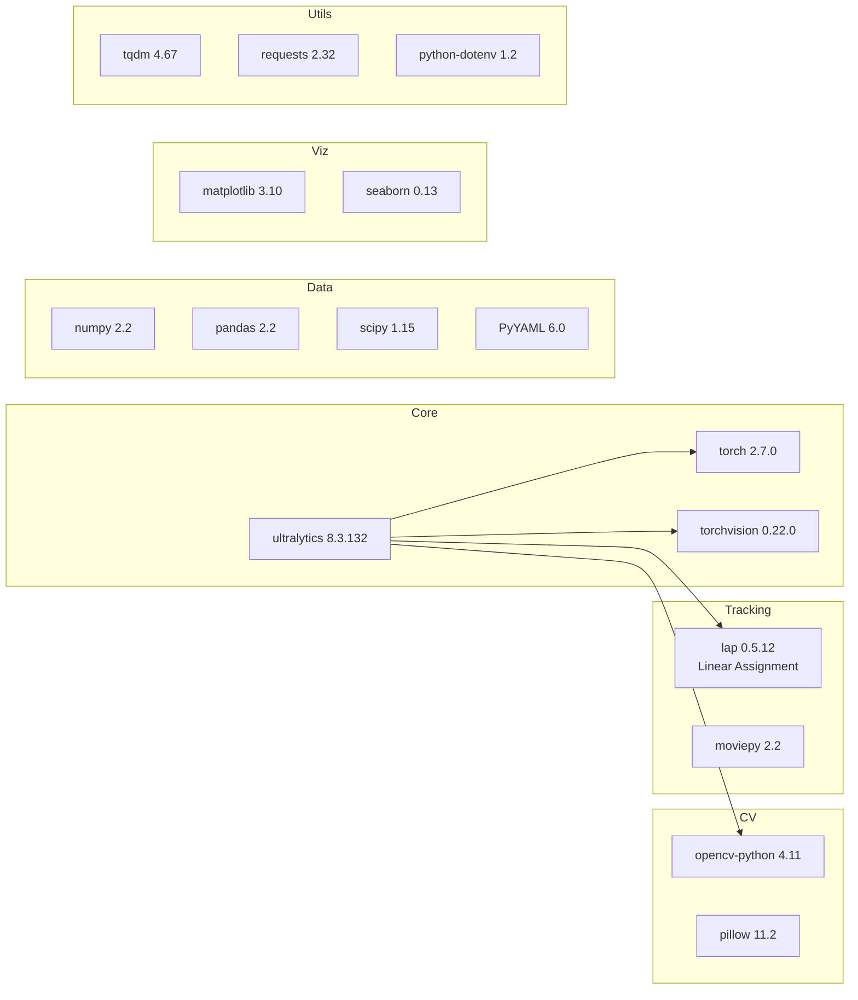

# Engineering & Architectural Overview

> **Project:** Off-Road Obstacle Detection — Master's Thesis (DP_2026)
> **Task:** Object detection and tracking in unstructured off-road terrain
> **Framework:** YOLO11 (Ultralytics) · PyTorch · OpenCV

> AI generated, Claude Sonet 4.6
---

## Table of Contents

1. [Project Summary](#1-project-summary)
2. [Repository Structure](#2-repository-structure)
3. [System Architecture](#3-system-architecture)
4. [Data Pipeline](#4-data-pipeline)
5. [Model Architecture](#5-model-architecture)
6. [Training Pipeline](#6-training-pipeline)
7. [Inference Pipeline](#7-inference-pipeline)
8. [Tracking System](#8-tracking-system)
9. [Module Reference](#9-module-reference)
10. [Class & Color Schema](#10-class--color-schema)
11. [Model Evolution](#11-model-evolution)
12. [Dependencies](#12-dependencies)

---

## 1. Project Summary

This project implements a CNN-based object detection and tracking system designed for identifying obstacles in unstructured off-road terrain. The system detects five obstacle classes (trees, bushes, stones, generic objects, and dogs) from both video streams and static images, using YOLO11 as the detection backbone with custom training on domain-specific datasets annotated via CVAT.

**Key capabilities:**
- Fine-tuned YOLO11 object detection on off-road imagery
- Multi-object tracking with persistent IDs across video frames
- Trajectory visualisation of detected obstacles
- Dataset tooling for annotation merge, splitting, and validation

---

## 2. Repository Structure

```
DP_2026/
├── DP/
│   ├── train_code/          # Training scripts (model_A → model_K)
│   ├── predict_code/        # Inference scripts (video, batch, stream)
│   ├── val_code/            # Evaluation / metric computation
│   ├── track_code/          # Multi-object tracking + trajectory plots
│   └── utils/               # Dataset tooling, visualisation helpers
├── runs/
│   └── detect/              # Training outputs (weights, metrics, plots)
│       └── {model_name}/
│           └── weights/
│               └── best.pt  # Best checkpoint used for inference
├── requirements.txt
└── README.md
```

---

## 3. System Architecture



---

## 4. Data Pipeline

```mermaid
flowchart LR
    subgraph Sources
        S1[palacak_*.MOV]
        S2[drone_*.MP4]
        S3[dobratice_*.MP4]
        S4[strelnice_*.MP4]
    end

    subgraph Preparation
        FE[Frame Extraction\n0.5 s interval]
        AN[CVAT Annotation\nBounding boxes]
        MC[merge_classes_tree.py\nOptional: collapse to 1 class]
    end

    subgraph Dataset["Dataset Layout (data_XX/)"]
        direction TB
        DY[data.yaml\nclass names + paths]
        TXT[train.txt · val.txt · test.txt]
        IMG["images/\n  Train/ · Validation/ · Test/"]
        LBL["labels/\n  Train/ · Validation/ · Test/\n  YOLO format: cls cx cy w h"]
    end

    Sources --> FE --> AN --> MC --> Dataset
```



**Label format** (YOLO normalised):
```
<class_id> <x_center> <y_center> <width> <height>
```
All coordinates are normalised to `[0, 1]` relative to image dimensions.

---

**Model variants used across training iterations:**

| Variant | Parameters | Usage |
|---------|-----------|-------|
| `yolo11n.pt` (Nano) | ~2.6 M | Models A, B, C, H |
| `yolo11s.pt` (Small) | ~9.6 M | Models F, G, I, J, K |

**Final training hyperparameters (model_K3):**

| Parameter | Value |
|-----------|-------|
| Image size | 640 × 640 |
| Batch size | 8 |
| Epochs | 150 |
| Early stopping patience | 150 |
| Optimizer | Auto (SGD/Adam) |
| Initial LR | 0.01 |
| Augmentation | AugMix + Mosaic + Random erasing |
| Multi-scale training | Enabled |
| Box loss weight | 7.5 |
| Classification loss weight | 0.5 |
| DFL loss weight | 1.5 |

---

## 6. Training Pipeline



**Loss components:**
- **Box loss** — bounding box regression (CIoU)
- **Classification loss** — class probability (BCE)
- **DFL loss** — distribution focal loss for precise localisation

---

## 7. Inference Pipeline



**Key inference scripts:**

| Script | Input | Mode |
|--------|-------|------|
| `predict_video.py` | Video file | Standard |
| `predict_video_stream.py` | Video file | Streaming (low memory) |
| `predict_dir.py` | Image directory | Batch |
| `predict_test.py` | Test split | Evaluation + COCO JSON |

---

## 8. Tracking System



**Tracking details:**
- Uses YOLO's built-in tracker (`persist=True`) for consistent ID assignment across frames
- Each track ID maintains a `deque` of up to 100 (x, y) centre-point positions
- Trajectories are drawn as polylines with class-specific colours
- A separate graph canvas renders coordinate axes and plots all active trajectories per frame

---

## 9. Module Reference

### `DP/utils/`

| Module | Purpose |
|--------|---------|
| `visualization.py` | `draw_custom_annotations()` — renders coloured boxes + labels on frames |
| `data_merge.py` | Merges CVAT exports into a unified YOLO dataset with 70/20/10 split |
| `frame_extraction.py` | Extracts frames from video at configurable intervals (default 0.5 s) |
| `labels_test_vis.py` | Visualises YOLO `.txt` labels overlaid on images |
| `clean_up_txt.py` | Removes stale image paths from dataset list files |
| `edit_dir.py` | Removes images that have no corresponding label file |
| `merge_classes_tree.py` | Collapses all class IDs to `0` for single-class tree experiments |
| `test_cuda.py` | Prints GPU name and CUDA availability |

### `DP/train_code/`

| Script | Dataset | Base model |
|--------|---------|-----------|
| `train_model_A.py` | data_01 | yolo11n.pt |
| `train_model_B.py` | data_02 | yolo11n.pt |
| `train_model_C.py` | data_02 | yolo11n.pt |
| `train_model_F.py` | data_03 | yolo11s.pt |
| `train_model_G.py` | data_04 | yolo11s.pt |
| `train_model_H.py` | data_04 | yolo11n.pt |
| `train_model_I.py` | data_05 | yolo11s.pt |
| `train_model_J.py` | data_05 | yolo11s.pt |
| `train_model_K.py` | data_06 | yolo11s.pt |

### `DP/predict_code/`

| Script | Description |
|--------|-------------|
| `predict_video.py` | Primary video inference with live display |
| `predict_video_stream.py` | Streaming variant for memory efficiency |
| `predict_dir.py` | Batch directory inference, saves results to disk |
| `predict_test.py` | Test-split inference, generates COCO JSON + YOLO predictions |

### `DP/val_code/`

| Script | Metrics |
|--------|---------|
| `val_model_I.py` | mAP50, mAP75, mAP50-95, per-class mAP |
| `val_model_K.py` | mAP50, mAP75, mAP50-95, per-class mAP |

### `DP/track_code/`

| Script | Description |
|--------|-------------|
| `tracker_plot_new.py` | Active tracking + dual output (video + trajectory graph) |
| `tracker_plot_old.py` | Previous tracking implementation |
| `track_model_H.py` | Tracking script for model_H |

---

## 10. Class & Color Schema

| ID | Class | Hex | RGB | Usage |
|----|-------|-----|-----|-------|
| 0 | Tree | `#31D300` | (49, 211, 0) | Green boxes |
| 1 | Bush | `#FFFF00` | (255, 255, 0) | Yellow boxes |
| 2 | Stone | `#800080` | (128, 0, 128) | Purple boxes |
| 3 | Object | `#0000FF` | (0, 0, 255) | Red boxes (BGR) |
| 4 | Dog | `#CFC0FF` | (203, 192, 255) | Pink boxes |

> Note: OpenCV uses BGR channel order internally; the RGB column above reflects the visual appearance.

---

## 11. Model Evolution



Each iteration introduced improvements to one or more of: dataset size and quality, augmentation strategy, base model capacity, learning rate schedule, and early stopping configuration.

---

## 12. Dependencies



---

*Generated 2026-03-24*
